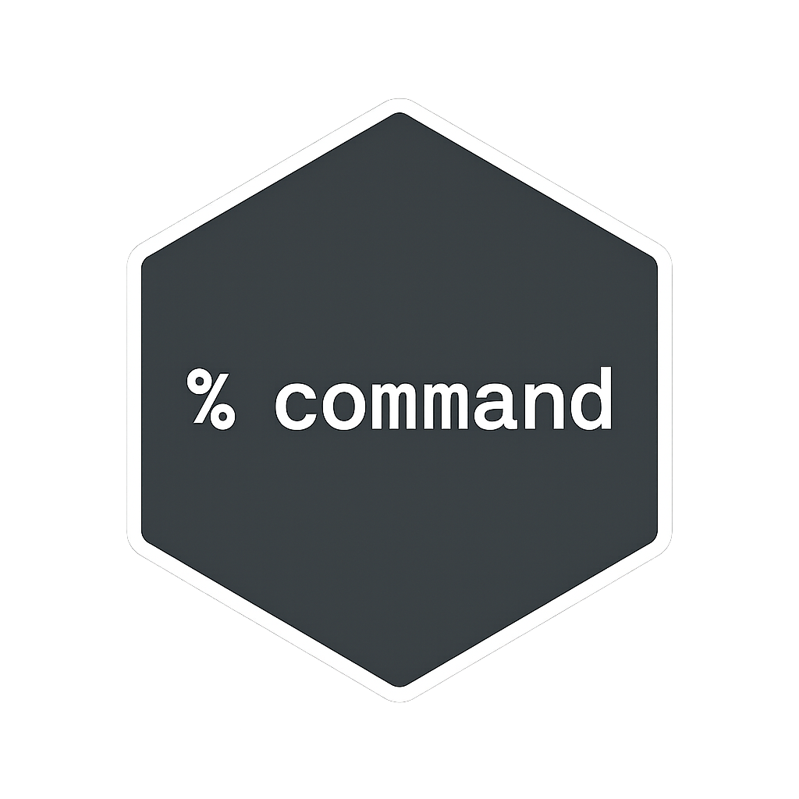

<!-- README.md is generated from README.Rmd. Please edit that file -->

<a href="https://github.com/bayesiandemography/command">
 </a>

# command

<!-- badges: start -->

[](https://lifecycle.r-lib.org/articles/stages.html#experimental)
[](https://github.com/bayesiandemography/command/actions/workflows/R-CMD-check.yaml)
[](https://app.codecov.io/gh/bayesiandemography/command?branch=main)
[](https://CRAN.R-project.org/package=command)
<!-- badges: end -->

Process command line arguments as part of data analysis workflow.

The main function is
[cmd_assign()](https://bayesiandemography.github.io/command/reference/cmd_assign.html).

For an overview of the package, see [Quick
Start](https://bayesiandemography.github.io/command/articles/a1_quickstart.html).

For ideas on building safe, modular workflows, see [Modular Workflows
for Data
Analysis](https://bayesiandemography.github.io/command/articles/a4_workflow.html).

## Installation

``` r
install.packages("command")
```

## Example

``` r
cmd_assign(.data = "data/raw_data.csv",
           date_start = "2025-01-01",
           trim_outliers = TRUE,
           .out = "out/cleaned_data.rds")
```
