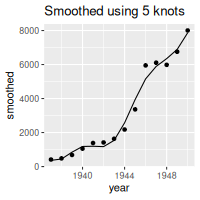

# Quick Start

## Introduction

This article shows how to get started with the `command` packages. It
focuses on the main function in the package,
[`cmd_assign()`](https://bayesiandemography.github.io/command/reference/cmd_assign.md).

[`cmd_assign()`](https://bayesiandemography.github.io/command/reference/cmd_assign.md)
is used to specify the inputs and outputs for a step in a data analysis
workflow. It can be called in two ways:

1.  interatively, or
2.  inside a script that is run from the command line.

Case 2 is the important one. However, Case 1 is simpler, so we look at
that first.

## Calling `cmd_assign()` interactively

Running

``` r
cmd_assign(obj1 = "a",
           obj2 = 1"))
```

has the same effect as running

``` r
obj1 <- "orange"
obj2 <- 1
```

Both snippets add two objects to the global environment with names
`"obj1"` and `"obj2"` and with values `"orange"` and `1`.

Objects added to the global environment by
[`cmd_assign()`](https://bayesiandemography.github.io/command/reference/cmd_assign.md)
can have the following classes:

- character, eg `"Hello world"`
- integer, eg `3L`
- numeric, eg `3.141593`
- date, eg `as.Date("2015-11-03")`
- date-time using POSIXct, eg `as.POSIXct("2015-11-03 14:23:03")`
- date-time using POSIXlt, eg `as.POSIXlt("2015-11-03 14:23:03")`
- `NULL`

The objects must have length 1, except for `NULL`, which has length 0.

The typical reason for using
[`cmd_assign()`](https://bayesiandemography.github.io/command/reference/cmd_assign.md)
interactively is to develop code that will eventually sit in a script
that is run from the command line.

The most common way to run R scripts from the command line is with
`Rscript`, so we take a detour to look at that.

## Rscript

`Rscript` is an application for running R scripts from the command line.
For more detail on the command line, see, for instance, episodes 1–3 of
[The Unix Shell](https://swcarpentry.github.io/shell-novice/index.html).
For an introduction to `Rscript`, see, for instance, [Command-Line
Programs](https://swcarpentry.github.io/r-novice-inflammation/05-cmdline.html).

The simplest usage of `Rscript` is a command such as

``` bash
Rscript myfile.R
```

This launches a new R session, runs whatever code is in `myfile.R`, and
ends the session. When the session ends, all objects created during the
session disappear, unless they were saved to disk.

`Rscript` accepts additional arguments, which are placed after name of
the script being run, as in

``` bash
Rscript myfile.R --n_iteration=10 output.rds
```

In this example, `--n_iteration=10` is a named argument, and
`output.rds` is an unnamed argument. Named arguments have the format

    --<name>=<value>

Note that there must not be a space between the name, the `=` sign, and
the value. The following command would therefore be invalid:

``` bash
Rscript myfile.R --n_iteration = 10 output.rds   # invalid!
```

Named arguments can also have a single dash and single letter, as in

``` bash
Rscript myfile.R -n=10
```

When `Rscript` is called with additional arguments, `Rscript` supplies
the names and values for these arguments to the R session. The names and
values can be accessed from within the session using base R function
[commandArgs()](https://search.r-project.org/R/refmans/base/html/commandArgs.html).
Working with [`commandArgs()`](https://rdrr.io/r/base/commandArgs.html)
is, however, tricky.
[`cmd_assign()`](https://bayesiandemography.github.io/command/reference/cmd_assign.md)
is an alternative to
[`commandArgs()`](https://rdrr.io/r/base/commandArgs.html), designed
specifically for data analysis workflows.

One alternative to `Rscript` is the package
[littler](https://CRAN.R-project.org/package=littler). `littler` does
not, however, run on Windows, and requires some command line magic
before it will run on macOS.
[`cmd_assign()`](https://bayesiandemography.github.io/command/reference/cmd_assign.md)
works as normal with `littler`.

## Calling `cmd_assign()` inside a script

We will work through an example where we call
[`cmd_assign()`](https://bayesiandemography.github.io/command/reference/cmd_assign.md)
inside a script that is being run from the command line.

Our current working directory contains two files:

``` fansi
.
├── airmiles.csv
└── fig_smoothed.R
```

The file `airmiles.csv` holds data on annual passenger numbers:

    year,passengers
    1937,412
    1938,480
    1939,683
    1940,1052
    1941,1385
    1942,1418
    1943,1634
    1944,2178
    1945,3362
    1946,5948
    1947,6109
    1948,5981
    1949,6753
    1950,8003

The file `fig_smoothed.R` contains the following code:

    ## Specify packages, inputs, and outputs ------------------

    suppressPackageStartupMessages({
      library(dplyr)
      library(ggplot2)
      library(command)
    })

    cmd_assign(.airmiles = "data/airmiles.csv",
               n_knot = 10,
               .out = "fig_smoothed.png")


    ## Read in data -------------------------------------------

    airmiles <- read.csv(.airmiles)


    ## Analyse ------------------------------------------------

    smoothed <- airmiles |>
      mutate(smoothed = fitted(smooth.spline(x = passengers,
                                             nknots = n_knot)))

    p <- ggplot(smoothed, aes(x = year)) +
      geom_line(aes(y = smoothed)) +
      geom_point(aes(y = passengers)) +
      ggtitle(paste("Smoothed using", n_knot, "knots"))


    ## Save results -------------------------------------------

    png(file = .out, width = 200, height = 200)
    plot(p)
    dev.off()

This code

- reads in data from a file whose name is specified by `.airmiles`,
- smooths the passenger data, with the amount of smoothing controlled by
  `n_knot`,
- plots the smoothed and unsmoothed values, and
- writes the plot out to a file whose name is specified by `.out`.

We use `Rscript` to run the code from the command line.

``` bash
Rscript fig_smoothed.R airmiles.csv --n_knot=8 fig_smoothed_8.png
```

``` fansi
✔ Assigned object `.airmiles` with value "airmiles.csv" and class "character".
✔ Assigned object `n_knot` with value 8 and class "numeric".
✔ Assigned object `.out` with value "fig_smoothed_8.png" and class "character".
null device 
          1 
```

`Rscript` started a new R session, ran the code using the command line
arguments we passed in, and ended the session. The messages about
assigning objects were generated by
[`cmd_assign()`](https://bayesiandemography.github.io/command/reference/cmd_assign.md).

The call to
[`cmd_assign()`](https://bayesiandemography.github.io/command/reference/cmd_assign.md)
in `fig_smoothed.R` created objects `.airmiles`, `n_knot`, and `.out`
inside the R session. The values for these objects were taken from the
command line, and *not* from the original call to
[`cmd_assign()`](https://bayesiandemography.github.io/command/reference/cmd_assign.md).
Hence, `n_knot` equaled `8` rather than `10`, and `.out` equaled
`"fig_smoothed_8.png"` rather than `"fig_smoothed.png"`.

Our working directory now looks like this:

``` fansi
.
├── airmiles.csv
├── fig_smoothed.R
└── fig_smoothed_8.png
```

We have a new file called `"fig_smoothed_8.png"`.

## What `cmd_assign()` does when called in a script

When
[`cmd_assign()`](https://bayesiandemography.github.io/command/reference/cmd_assign.md)
is called in a script that is being run from the command line, it does
three things:

1.  **Match** command line arguments against arguments in
    [`cmd_assign()`](https://bayesiandemography.github.io/command/reference/cmd_assign.md).
2.  **Coerce** each value supplied at the command line to have the same
    class as the corresponding value in the call to
    [`cmd_assign()`](https://bayesiandemography.github.io/command/reference/cmd_assign.md).
3.  **Assign** the resulting values to the global environment.

Suppose we have a script called `model.R` containing the following call
to
[`cmd_assign()`](https://bayesiandemography.github.io/command/reference/cmd_assign.md):

``` r
cmd_assign(.data = "data/dataset.csv",
           n_iter = 5,
           use_log = TRUE,
           .out = "out/model.rds")
```

We run `model.R` from the command line using

``` bash
Rscript model.R \
  data/dataset2.csv \
  out/model2.rds \
  --use_log=TRUE \
  --n_iter=10
```

(The backslashes `\` here mean “treat the next line of text as a
continuation of the current line”.)

When
[`cmd_assign()`](https://bayesiandemography.github.io/command/reference/cmd_assign.md)
is first called, it holds the following values:

| Argument  | Value from call      | Value from command line |
|:----------|----------------------|-------------------------|
| `.data`   | `"data/dataset.csv"` | \<none\>                |
| `n_iter`  | `5`                  | \<none\>                |
| `use_log` | `TRUE`               | \<none\>                |
| `.out`    | `"out/model.rds"`    | \<none\>                |

In the **match** step,
[`cmd_assign()`](https://bayesiandemography.github.io/command/reference/cmd_assign.md)
finds the values that were passed in from the command line. First it
matches named arguments from the command line with named arguments from
the call, yielding

| Argument  | Value from call      | Value from command line |
|:----------|----------------------|-------------------------|
| `.data`   | `"data/dataset.csv"` | \<none\>                |
| `n_iter`  | `5`                  | `10`                    |
| `use_log` | `TRUE`               | `"TRUE"`                |
| `.out`    | `"out/model.rds"`    | \<none\>                |

Then it matches unnamed arguments from the command line with unused
arguments from the call. The matching of unnamed arguments is based on
the order in which the unnamed arguments were supplied to the command
line. In our example, the value `"data/dataset2.csv"` was supplied
before `"out/model2.rds"`, so `"data/dataset2.csv"` comes before
`"out/model2.rds"` in the matched results.

| Argument  | Value from call      | Value from command line |
|:----------|----------------------|-------------------------|
| `.data`   | `"data/dataset.csv"` | `"data/dataset2.csv"`   |
| `n_iter`  | `5`                  | `"10"`                  |
| `use_log` | `TRUE`               | `"TRUE"`                |
| `.out`    | `"out/model.rds"`    | `"out/model2.rds"`      |

The values supplied at the command line all start out as text strings.
In the **coerce** step,
[`cmd_assign()`](https://bayesiandemography.github.io/command/reference/cmd_assign.md)
converts these values to have the same classs as the matched values from
[`cmd_assign()`](https://bayesiandemography.github.io/command/reference/cmd_assign.md).
In our example, this means coercing `"10"` to `numeric` and coercing
`"TRUE"` to `logical`.

| Argument   | Value from call      | Value from command line |
|:-----------|----------------------|-------------------------|
| `.data`    | `"data/dataset.csv"` | `"data/dataset2.csv"`   |
| `n_iter`   | `5`                  | `10`                    |
| `use_long` | `TRUE`               | `TRUE`                  |
| `.out`     | `"out/model.rds"`    | `"out/model2.rds"`      |

Finally, in the **assign** step,
[`cmd_assign()`](https://bayesiandemography.github.io/command/reference/cmd_assign.md)
puts the values in the global environment.

The number of arguments passed through the command line must exactly
match the number of arguments specified in the call to
[`cmd_assign()`](https://bayesiandemography.github.io/command/reference/cmd_assign.md).
Values specified in the call to
[`cmd_assign()`](https://bayesiandemography.github.io/command/reference/cmd_assign.md)
do *not* act as defaults. For instance, in our example,
[`cmd_assign()`](https://bayesiandemography.github.io/command/reference/cmd_assign.md)
would not let us omit `use_log`, and the following would be invalid:

``` bash
Rscript model.R \
  data/dataset2.csv \
  out/model2.rds \
  --n_iter=10  # invalid!
```

The rationale for not having defaults is that specifying all the
arguments makes a workflow clearer and safer.

## Argument names starting with a dot

In all the examples so far, objects holding paths or filenames have
conformed to a particular naming convention: they have all had names
that start with a dot. For instance:

``` r
cmd_assign(.data = "data/dataset.csv", # '.data'
           n_iter = 5,
           use_log = TRUE,
           .out = "out/model.rds")     # '.out'
```

The aim is to distinguish between *values* and *references to values*.
`n_iter` and `use_log` in the example above hold values that are
directly used in the analysis. `.data` and `.out`, in contrast, specify
the place where the values used in the analysis are stored.

To access the values referred to by the “dot” variables, we use a
function such as [`readRDS()`](https://rdrr.io/r/base/readRDS.html) or
`read_csv()`, as in

``` r
data <- read_csv(.data)
```

Function
[`cmd_assign()`](https://bayesiandemography.github.io/command/reference/cmd_assign.md)
itself makes no distinction between names that start with dots and names
that do not. However, functions
[`extract_shell()`](https://bayesiandemography.github.io/command/reference/extract_shell.md),
`shell()`, discussed in [Creating a Shell
Script](https://bayesiandemography.github.io/command/articles/a2_shell_script.html),
and
[`extract_make()`](https://bayesiandemography.github.io/command/reference/extract_make.md)
and
[`makefile()`](https://bayesiandemography.github.io/command/reference/makefile.md),
discussed in [Creating a
Makefile](https://bayesiandemography.github.io/command/articles/a3_makefile.html),
do make a distinction. Moreover, the convention is useful anyway, to
separate values from references.

## Giving code files and outputs the same base name

Another feature of the examples so far is that R files have the same
base name as the files that they generate. File `fig_smoothed.R`, for
instance, generates `fig_smooth.png`, `fig_smooth_5.png`,
`fig_smooth_8.png`, and `fig_smooth_10.png`, and file `model.R`
generates `model.rds` and `model2.rds`. We rely on file extensions (eg
`.R` vs `.png`, or `.R` vs `.rds`) to distinguish code from outputs, and
we use suffixes (eg `_5`, `_8` and `_10`) to distinguish different
versions of the same output.

The same-base-names convention is common in programming, and is a good
way to signal the relationship between code and outputs.

## Putting calls to Rscript in a shell script

We can control a data analysis workflow by writing a shell script with
calls to `Rscript`.

We illustrate with a simple example. We need two more files. The first
file, called `report.qmd`, creates a report with two figures:

    ---
    title: "Smoothed Passenger Miles"
    format: html
    ---

    We smoothing our data using a spline with 5 knots:

    ```{r}
    #| label: fig_smoothed_5
    #| echo: false
    
    ```

    And smooth it again using a spline with 10 knots

    ```{r}
    #| label: fig_smoothed_10
    #| echo: false
    knitr::include_graphics("fig_smoothed_10.png")
    ```

The second file, called `workflow.sh`, is a shell script that runs the
whole workflow. It contains the following code:

    Rscript fig_smoothed.R airmiles.csv 5 fig_smoothed_5.png 

    Rscript fig_smoothed.R airmiles.csv 10 fig_smoothed_10.png 

    quarto render report.qmd

(The third command in the code above calls the `quarto` application
directly, rather than through the R function
[quarto_render](https://quarto-dev.github.io/quarto-r/reference/quarto_render.html).)

We run `workflow.sh`.

``` bash
bash workflow.sh
```

``` fansi
✔ Assigned object `.airmiles` with value "airmiles.csv" and class "character".
✔ Assigned object `n_knot` with value 5 and class "numeric".
✔ Assigned object `.out` with value "fig_smoothed_5.png" and class "character".
null device 
          1 
✔ Assigned object `.airmiles` with value "airmiles.csv" and class "character".
✔ Assigned object `n_knot` with value 10 and class "numeric".
✔ Assigned object `.out` with value "fig_smoothed_10.png" and class "character".
null device 
          1 


processing file: report.qmd
1/5                  
2/5 [fig_smoothed_5] 
3/5                  
4/5 [fig_smoothed_10]
5/5                  
output file: report.knit.md

pandoc 
  to: html
  output-file: report.html
  standalone: true
  section-divs: true
  html-math-method: mathjax
  wrap: none
  default-image-extension: png
  variables: {}
  
metadata
  document-css: false
  link-citations: true
  date-format: long
  lang: en
  title: Smoothed Passenger Miles
  
Output created: report.html
```

Our working directory now contains the two graphs and the report (plus a
directory, called `report_files`, created by quarto.)

``` fansi
.
├── airmiles.csv
├── fig_smoothed.R
├── fig_smoothed_10.png
├── fig_smoothed_5.png
├── fig_smoothed_8.png
├── report.html
├── report.qmd
├── report_files
└── workflow.sh
```

## Putting calls to Rscript in a Makefile

An even better way to organize a data analysis workflow is to put the
`Rscript` commands in a Makefile. For an introduction to Makefiles, see
[Project Management with
Make](https://jeroenjanssens.com/dsatcl/chapter-6-project-management-with-make).

Here is the Makefile equivalent of the shell script above:

    .PHONY: all
    all: report.html

    fig_smoothed_5.png: fig_smoothed.R airmiles.csv
        Rscript $^ $@ --n_knot=5  

    fig_smoothed_10.png: fig_smoothed.R airmiles.csv
        Rscript $^ $@ --n_knot=10

    report.html: report.qmd fig_smoothed_5.png fig_smoothed_10.png
        quarto render $<

The line `all: report.html` says that our ultimate aim is to create a
file called `report.html`. The remaining lines describe the steps to get
there, including the output (eg `fig_smoothed_5.png`), the inputs (eg
`fig_smoothed.R` and `airmiles.csv`), and the action needed to produce
the output from the inputs (eg `Rscript $^ $@ --n_knot=5`). [Modular
Workflows for Data
Analysis](https://bayesiandemography.github.io/command/articles/workflow.html)
contains more information on Makefiles, including an explanation of the
mysterious `$^` and `$@` symbols.

Makefiles are run using the `make` application. `make` is present on all
Linux and MacOS systems, but may need installing on Windows.

Makefiles and `make` take time to master. A Makefile is, however, an
excellent way to document dependencies within a workflow. `make` can
also be used to update a workflow safely and efficiently, because, when
it updates, `make` keeps track of dependencies.

Observe what happens, for instance, if we delete `fig_smoothed_5.png`
and then run `make`.

``` bash
rm fig_smoothed_5.png
make
```

``` fansi
Rscript fig_smoothed.R airmiles.csv fig_smoothed_5.png --n_knot=5  
✔ Assigned object `.airmiles` with value "airmiles.csv" and class "character".
✔ Assigned object `n_knot` with value 5 and class "numeric".
✔ Assigned object `.out` with value "fig_smoothed_5.png" and class "character".
null device 
          1 
quarto render report.qmd


processing file: report.qmd
1/5                  
2/5 [fig_smoothed_5] 
3/5                  
4/5 [fig_smoothed_10]
5/5                  
output file: report.knit.md

pandoc 
  to: html
  output-file: report.html
  standalone: true
  section-divs: true
  html-math-method: mathjax
  wrap: none
  default-image-extension: png
  variables: {}
  
metadata
  document-css: false
  link-citations: true
  date-format: long
  lang: en
  title: Smoothed Passenger Miles
  
Output created: report.html
```

`make` runs the code for creating `fig_smoothed_5.png`, and then,
because it knows that `report.html` depends on `fig_smoothed_5.png`, it
runs the code for that too. It does, not, however, run the code for
`fig_smoothed_10.png`, because it knows that `fig_smoothed_10.png` does
not depend on `fig_smoothed_5.png`.

## Alternatives to `cmd_assign()`

Function [`commandArgs()`](https://rdrr.io/r/base/commandArgs.html) in
package [R.utils](https://cran.r-project.org/package=R.utils) is a
user-friendly version of the base R function. Packages providing tools
for parsing command line include
[argparse](https://cran.r-project.org/package=argparse),
[docopt](https://cran.r-project.org/package=docopt),
[getopt](https://cran.r-project.org/package=getopt), and
[optparse](https://CRAN.R-project.org/package=optparse). `command` is,
however, the only package which focuses specifically on processing
inputs and outputs within a data analysis workflows.

The `command` package is designed for workflows where the basic building
block is the file. An alternative to this ‘file-oriented’ approach is a
‘function-oriented’ approach. Tools for implementing a function-oriented
approach are implemented by package
[targets](https://CRAN.R-project.org/package=targets).
