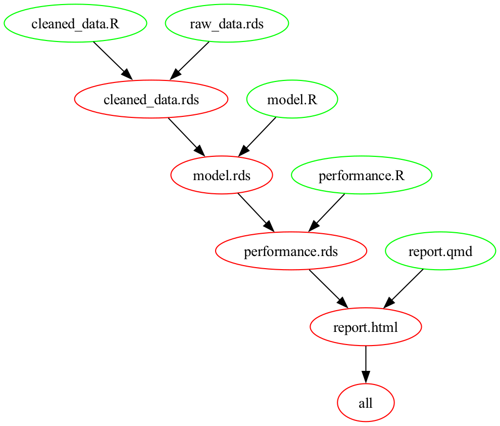

```{r, include = FALSE}
library(command)
library(fs)
path_swiss <- path_package(package = "command",
                           "extdata/swiss2")
dir_copy(path = path_swiss,
         new_path = ".",
         overwrite = TRUE)

knitr::opts_chunk$set(collapse = TRUE,
                      engine.opts = "-l",
                      comment = "")

old_hooks <- fansi::set_knit_hooks(knitr::knit_hooks) ## so colors work
nms_articles <- "a1_quickstart.Rmd|a2_shell_script.Rmd|a3_makefile.Rmd|a4_workflow.Rmd|references.bib|makefile_deps.png"
```


> The computations and the software for data analysis should be trustworthy: they should do what they claim, and be seen to do so [@chambers2008software, p.3].

> The only way to write complex software that won't fall on its face is to build it out of simple modules connected by well-defined interfaces, so that most problems are local and you can have some hope of fixing or optimizing a part without breaking the whole [@raymond2003art, ch. 1].


# Introduction

Code for a data analysis should be accurate, transparent, and flexible. It should do what the report on the analysis say it does, and it should be written in a way that makes it easy to understand and modify. In software engineering, and in the design of systems more generally, one of the key ways of achieving accuracy, transparency, and flexibility is through modularity [@simon2019sciences]. A modular system is built out of many small, self-contained units. Each of these units has a single purpose, has well-defined inputs and outputs, and has only limited knowledge about other units.

Ideas about modularity underlie much standard R advice about writing code for data analysis. RStudio-style projects, for instance, are an example of modular design [@wilson2017good; @wickham2023r; @projecttemplate2025project]. However, many actual data analyses written in R are the opposite of modular. For instance, the entire workflow is often contained in a single, huge script that is responsible for everything from importing data to fitting to creating plots. Even when code for an analysis is divided into smaller scripts, these smaller scripts often have diffuse aims and complex inputs and outputs. Heavy use of `source()` commands mean that many scripts contribute objects to the current working environment, and no script can be understood in isolation. Changes to one part of a workflow have large, unexpected implications for other parts of the workflow.

This article presents a strategy for making data analysis workflows more strictly modular. The basic unit in this strategy is a script. Each script is responsible for one small task, with inputs and outputs tightly controlled. Each script runs in its own environment, and data and intermediate outputs are passed around by reading from and writing to disk. Information about the project as a whole is held in a single orchestration file, which serves as an executable description of the analysis. 

The article describes the main elements of the strategy, presents an example, and lists some costs and benefits. The final section gives some suggestions about implementation details.

# A strategy for constructing a modular workflow

## Use lots of small scripts

A data analysis workflow should be composed of many small scripts. Each of these small scripts should have a single well-defined task. In most cases, the task will be to turn some inputs into an output. The new output could itself be an input for other tasks, or it could a final product, such as a report. In either case, each script should be self-contained, in the sense that it can be interpreted and used on its own.

Some typical inputs and outputs in data analyses are:

| Input     |   Output       |
|:-----------|:---------------|
| Raw data set | Cleaned data set |
| Two cleaned data sets | Single merged data set |
| Cleaned data set | CSV file for distribution |
| Cleaned data set | Values for plotting |
| Values for plotting | Plot |
| Cleaned data set | Fitted model object |
| Cleaned data set and fitted model object | Actual and predicted values |
| Actual and predicted values | Plot |
| Multiple fitted model objects | Scores for performance metrics |
| Scores for performance metrics | Values for table |
| Values for table | Table |

The one-task-one-script rule can lead to scripts that are very short. For instance, if the task is to merge two cleaned datasets, then the script might contain only a few lines of code.

Occasionally, a script does need to be long, because breaking the task into subtasks increases, rather than decreases, complexity. A long script should, however, be subjected to extra checking, and should include a comment explaining to future maintainers why the extra length was necessary.


## Use Rscript or littler to run each script in a new session

Each script should run in a new, clean R session that ends when script has finished running. Any packages (aside from base R packages) that are required by a script should be loaded explicitly. Running each script in its own session implies that, when the script completes, all objects created during by the script that were not saved to disk disappear.

The best way to give each script its own session is to run the script from the command line, using an application such as [Rscript](https://stat.ethz.ch/R-manual/R-devel/library/utils/html/Rscript.html) or [littler](https://CRAN.R-project.org/package=littler). For instance, the call
```{bash, eval = FALSE}
Rscript my-script.R
```
starts a new R session, runs the code in `my-script.R`, and ends the session.

For an introduction to Rscript see [here](https://swcarpentry.github.io/r-novice-inflammation/05-cmdline.html), and for an introduction to littler, see [here](https://CRAN.R-project.org/package=littler).


## Use command line arguments to define inputs and outputs

Rscript and littler both allow the user to supply command line arguments to the script being run. Values for these arguments are accessible inside the session. The command
```{bash, eval = FALSE}
Rscript my-script.R my-data.csv my-output.rds --n_digits=3
```
for instance, makes the strings `"my-data.csv"`, `"myoutput.rds"`, and `"3"` accessible inside the session where `my-script.R` is run. Expressions of the form `--<name>=<object>` can be used to assign names to the strings. In the command above, for example, the strings `"my-data.csv"` and `"myoutput.rds"` have no names, and the string `"3"` has the name `n_digits`.

Values for command line arguments can be retrieved within the session using base R function [commandArgs()](https://stat.ethz.ch/R-manual/R-devel/library/base/html/commandArgs.html), followed by some manipulation and reformatting. For instance, values from the call above can be retrieved using
```{r, eval = FALSE}
args <- commandArgs(trailingOnly = TRUE)
filename_input <- args[[1]]
filename_output <- args[[2]]
n_digits <- as.integer(strsplit(args[[3]], split = "=")[[1]][[2]])
```
As this example illustrates, using base R function `commandArgs()` to parse command line arguments can be fiddly. Packages `argparse`, `docopt`, `getopt`, `optparse`, and `R.utils` all implement high-level alternatives to base R `commandArgs()` [@dejonge2018docopt; @david2023optparse; @pav2023argparse; @david2020getopt; @bengtsson2023rutils].

The `command` package is one further alternative, designed specifically for data analysis workflows. Function `cmd_assign()` in `command` automatically checks and reformats arguments, and assigns values within the working environment. For an introduction to `command`, see [Quick Start](https://bayesiandemography.github.io/command/articles/a1_quickstart.html).

The ability to pass arguments to scripts essentially turns the scripts into functions. If, for instance, we want to run the code in `my-script.R` on `my-other-data.csv`, rather than `my-data.csv`, then we use something like
```{bash, eval = FALSE}
Rscript my-script.R my-other-data.csv my-other-output.rds --n_digits=3
```
If we want to process `my_data.csv`, but we want to use 5 digits rather than 3, then we use something like
```{bash, eval = FALSE}
Rscript my-script.R my-data.csv my-output.rds --n_digits=5
```


## Run everything from an orchestration file

An orchestration file controls a workflow. Running the orchestration file for an analysis should reproduce the entire analysis, from the ingesting of the raw data to the compilation of the final report.

Orchestration files are often written in R, and take the form
```{r, eval = FALSE}
source("cleaned_data.R")
source("model.R")
source("performance.R")
quarto::quarto_render("report.qmd")
```

The script runs `cleaned_data.R` to create a cleaned dataset, runs `model.R` to fit a model to this dataset, runs `performance.R` to collect information on model performance, and renders the `report.qmd` file to create the analysis report.

Orchestration files consisting of a succession of `source()` calls have major some disadvantages. Repeated use of `source()` means that all code is run in the same environment, breaking modularity. The lack of definitions of inputs or outputs make the workflow harder to understand or control.

A better approach is to use a shell script, such as
```{bash, eval = FALSE}
Rscript cleaned_data.R raw_data.rds cleaned_data.rds

Rscript model.R cleaned_data.rds model.rds --n_iter=2000

Rscript performance.R model.rds performance.rds

quarto render report.qmd
```

An even better approach is to use a Makefile. A Makefile version of the shell script above is
```{bash, eval = FALSE}
.PHONY: all
all: report.html

cleaned_data.rds: cleaned_data.R raw_data.rds
        Rscript $^ $@

model.rds: model.R cleaned_data.rds
        Rscript $^ $@ --n_iter=2000

performance.rds: performance.R model.rds
        Rscript $^ $@

report.html: report.qmd performance.rds
        Rscript $<
```	
The lines
```{bash, eval = FALSE}
.PHONY: all
all: report.html
```
at the top of the Makefile define the final output or outputs from the workflow. Lines such as
```{bash, eval = FALSE}
cleaned_data.rds: cleaned_data.R raw_data.rds
        Rscript $^ $@
```	
specify a Makefile *rule*. A rule contains a

- a *target*, in this case `cleaned_data.rds`;
- *prerequisites*, in this case `cleaned_data.R` and `raw_data.rds`; and
- a *recipe* for creating the target from the prerequisites, in this case `Rscript $^ $@`.

The `$^` and `$@` in `Rscript $^ $@` are "automatic variables". When the Makefile runs, the phrase `Rscript $^ $@` expands to `Rscript cleaned_data.R raw_data.rds cleaned_data.rds`.

The `make` application uses the Makefile to construct a dependency graph for the inputs and outputs in the workflow. The Makefile above yields the graph
```{r makefile-graph, echo = FALSE, fig.align = "center", out.width = "45%"}

```

If `make` sees that a dependency is older than one of the prerequisites, then it will recreate that dependency, and all dependencies downstream of it. For instance, in the example above, if `make` saw that `performance.rds` was older than `model.rds`, then it would recreate `performance.rds` and `report.html`. It would not, however, create `model.rds` itself, or `cleaned_data.rds`. For more on Makefiles, see, for instance,  @broman2013minimal, @baker2020using, @janssens2021data, and @turing2025make.


## Reports

Applications such as R Markdown [@xie2018rmarkdown] and Quarto [@posit2025quarto] allow authors to combine code and text within a single document. It is common to see authors put *all* the code for an analysis in an R Markdown or Quarto document. This can be effective with small analyses, such as the exploration of a new dataset. But it does not scale well. Analyses where all the code is contained in a single R Markdown or Quarto file suffer from all the usual pathologies of a large, complicated code file, along with the extra challenge of coping with markdown errors.

A more modular, scalable alternative is to do the analysis outside the report, and to limit code within the report to snippets that read in results and apply formatting. A plot, for instance, can be constructed in its own script, and then read into the report using a command like ``. 

Unfortunately, R Markdown and Quarto do not currently allow users to supply command line arguments in the way that Rscript and littler do.

# An example

We use a small example to illustrate the various components of the strategy described in this paper. The project folder for the example looks like this:

```{r, echo = FALSE}
dir_tree(regexp = paste(nms_articles, "report_files", sep = "|"),
         invert = TRUE)
```

The Makefile and report sit at the top level. There are subfolders folders for the raw data (`data`), the code (`src`) and the outputs (`out`).

The flow of data and outputs is set out in the Makefile:

```{r, echo = FALSE}
cat(readLines("Makefile"), sep = "\n")
```

The ultimate goal is to produce file `report.html`. To get there, we go through the following steps:

- produce `cleaned_data.rds` by applying `cleaned_data.R` to `raw_data.csv`;
- produce `model_m.rds` by applying `model.R` to `cleaned_data.rds`, with setting `--method=M`;
- produce `model_mm.rds` by applying `model.R` to `cleaned_data.rds`, with setting `--method=MM`;
- produce `vals_fitted.rds` by applying `vals_fitted.R` to `cleaned_data.rds`, `model_m.rds`, and `model_mm.rds`;
- produce `fig_fitted.png` by applying `fig_fitted.R` to `vals_fitted.rds`; and
- produce `report.html` by applying `report.qmd` to `fig_fitted.png`.

File `cleaned_data.R` contains the following code:

```{r, echo = FALSE}
cat(readLines("src/cleaned_data.R"), sep = "\n")
```

This code

- loads the packages needed for this script;
- uses function `cmd_assign()` from package `command` to extract the values that were passed at the command line, giving them names `.raw_data`, and `.out`;
- reads in the raw data, using the filename specified by `.raw_data`;
- transforms the raw data into cleaned data; and
- writes out the cleaned data, using the filename specified by `.out`.

File `model.R` contains the code

```{r, echo = FALSE}
cat(readLines("src/model.R"), sep = "\n")
```

The overall structure is similar to that of `cleaned_data.R`. Unlike `cleaned_data.R`, however, `model.R` is called twice. On the first call, the named argument `method` is set to `M`, and the output is captured in file `model_m.rds`:
```{bash, eval = FALSE}
out/model_m.rds: src/model.R \
  out/cleaned_data.rds
    Rscript $^ $@ --method=M
```
On the second call, `method` is set to `MM`, and the output is captured in file `model_mm.rds`:
```{bash, eval = FALSE}
out/model_mm.rds: src/model.R \
  out/cleaned_data.rds
    Rscript $^ $@ --method=MM
```

By passing arguments to `model.R` when we run it, we can make `model.R` behave like a function.

The two remaining R scripts, `fig_fitted.R` and `vals_fitted.R`, follow the same basic format as `cleaned_data.R` and `model.R`, and are discussed in the Appendix.

The Quarto file `report.qmd` looks like this:

```{r, echo = FALSE}
cat(readLines("report.qmd"), sep = "\n")
```

The file focuses on text rather than code. The single piece of R code is a call to `knitr::include_graphics()`.


# Costs of the strategy

## Learning new tools

Analysts who are not familiar with the command line, shell scripts, and Makefiles will need to devote time to learning them about them. Makefiles, in particular, can take some time to get used to, with their mysterious `$^` and `$@` symbols and their tricky use of tabs. Learning these tools, and finding solutions when something goes wrong, has, however, become much easier with the advent of AI-based assistants. 


## Extra overhead

The strategy described in this paper requires some writing some extra code. Every script in an analysis requires a few extra lines to deal with command line arguments, and needs a mention in the orchestration file.


# Benefits of the strategy

## Writing code

Modularity makes code easier to write. Breaking the analysis into smaller pieces makes it feel more manageable. A small script that has one job is much places fewer demands on a programmer's memory and concentration than a large script with many jobs. The more self-contained a script is, and the fewer assumptions it makes about the rest of the project, the less likely it is to need revision as the project evolves.

Modularity also helps with one of the most difficult tasks in programming: naming things [@mcconnell2004code, Chapter 11]. The challenge of finding appropriate names, and avoiding name clashes, is particularly acute in a long file carrying out multiple tasks, where it becomes necessary to distinguish, for instance, between `model_baseline`, `model_revised`, `model_revised_subset`, and so on. Having short scripts, each run in its own session, allows analysts to re-use names without name clashes.


## Reading code

Code that takes the form of small, self-contained units is also much easier to read. A small script with a single objective can be understood much more quickly than a large script with several objectives. Code constructed out of semi-independent units can be picked up part way through, sparing the reader the need to read all the code just to understand one part of it.

## Documentation

Computer code should ideally by 'self-documenting': it should make the programmer's intent sufficiently clear that the need for additional aids, such as inline comments or README files, is minimized [@mcconnell2004code, Chapter 32]. Many of the techniques described in this paper lead to code that is self-documenting. The orchestration file, for instance, serves as a summary of the overall workflow, and the command line arguments serve as a description of the inputs and outputs.


## Debugging

Keeping scripts short, running each script in its own session, and explicitly defining the inputs to each session mean that, if something goes wrong, there should only be a few objects in the working environment, and the origins of these objects should be clear. Debugging is a lot less painful than it might otherwise be.


## Flexibility

Small scripts, with clearly-defined inputs, outputs, and tasks are composable: they can be combined with other scripts in many different ways. If, for instance, we have one script to derive performance measures, and a second script to plot these measures, then it is easy to add a third script to display the performance measures in a table. This sort of flexibility is particularly helpful in data analyses where there is uncertainty about the nature of the data the the most appropriate models, plots, and so forth.

## Scalability

Saving intermediate outputs to disk reduces the amount of memory needed, and reduces the need to re-run calculations from the beginning. These savings can be important in projects with large datasets or long computation times. Makefiles are particularly helpful in such settings, since they make sure that computations are carried out when they are needed, but only when they are needed.


# Some suggestions about implementation

## Let the orchestration file impose order

A common recommendation in advice on writing analysis code is to number files, such as `01-ingest-data.R`, `02-clean-data.R`, `03-fit-model.R`, and so on. The problem with numbering is that analysting data is unpredictable, and new files often need to be added, or existing files deleted. For instance, we might discover that we need an impute-missing-values step between our clean-data step and our fit-model step. If we have numbered our files, any such change requires a large-sale renumbering. This can be annoying.

An alternative is to rely entirely on the orchestration file to record the order in which files are run. When there is an orchestration file, numbering becomes redundant.

When building a dependency graph, the `make` application relies entirely on targets and prerequisites, and ignores the physical position of rules within the file. As a courtesy to human readers, however, a Makefile should list the rules in the order in which they are executed.


## Re-use base names

The computer science convention where related files are given the same base name and different extensions -- e.g. `report.tex`, `report.aux`, `report.toc`, `report.log`, and `report.pdf` --  can also be applied in data analysis workflows. For instance, a file named `model_baseline.R` creates a model object, which is stored in a file named `model_baseline.rds`. As well as signaling relationships, re-using base names reduces the need to think up new names.


## Objects holding file paths start with a dot

Often, when running a script, we read an object from a file, using a file path supplied at the command line. For instance, we read an object from a file called `model.rds`, which we identify using the path `out/model.rds`, which was supplied at the command line. In such cases, we need names for (i) the object we read in, and (ii) the path to the file where the object is stored.

A useful convention is to give (ii) the same name as (i), but with a dot at the front. For instance, if we give object that we read in the name `model`, then  we give the object holding the path the name `.model`.

Following this convention leads to code such as
```{r, eval = FALSE, echo = TRUE}
cmd_assign(.data = "out/model.rds",
           .out = "out/vals_fitted.rds")

model <- readRDS(.model)
```

The distinction between the object and the path to the object is analogous to the distinction between a value and a reference to a value. The dot-name convention makes the connection between the value and the reference clear, but also alerts the reader to the fact that objects holding file paths are a little unusual.


## Refrain from using advanced Makefile features

Makefiles have an enormous range of features. The extra power tends, however, to come at the expense of readability. Moreover, most data analysis projects have a sufficiently simple structure that the extra power is not really needed. If 'VPATH directives' are added to a Makefile, for instance, then directory names can be omitted from file paths, so that `model.R` can be used instead of `src/model.R` [@gnu2024make, Section 4.5]. But omitting directory names makes Makefiles much harder to understand for readers who are not Makefile experts.

## Orchestration and report files at the top

The orchestration file, and any report files in LaTeX, R Markdown, Quarto, or similar, should sit at the top level of the project, rather than in a subfolder with the other code. This, for instance, is the way that the project in the Example section is structured. There are pragmatic reasons for placing orchestration and report files at the top level: Makefiles, LaTeX files, and markdown files all generally assume that they are at the top level, and require special handling if they are not. But orchestration and report files also earn their special treatment, because they have a special status within the project. Orchestration files control all the other files, and the report is typically the ultimate objective of the project. 


# Appendix

File `vals_fitted.R` from the example contains the following code:

```{r, echo = FALSE}
cat(readLines("src/vals_fitted.R"), sep = "\n")
```

This code

- loads the packages that are used in the code;
- creates strings called `.cleaned_data`, `.model_m`, `.model_mm`, and `.out`, based on values passed at the command line;
- creates objects `cleaned_data`, `model_m`, and `model_mm`, by reading from files specified by `.cleaned_data`, `.model_m`, and `.model_mm`;
- combines and reformats the contents of `cleaned_data`, `model_m`, and `model_mm`; and
- writes out the result, to a file specified by `.out`.


File `fig_fitted.R` contains the code

```{r, echo = FALSE}
cat(readLines("src/fig_fitted.R"), sep = "\n")
```

This code

- loads the packages that are used in the code;
- creates strings called `.vals_fitted` and `.out`, based on values passed at the command line;
- creates object `vals_fitted`, by reading from the file specified by `.vals_fitted;
- creates a plot, based on `vals_fitted`; and
- prints the plot in a file specified by `.out`.


# References


```{r, include = FALSE}
files_to_delete <- dir_ls(regexp = nms_articles, 
                          invert = TRUE)
file_delete(files_to_delete)
```

