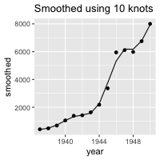
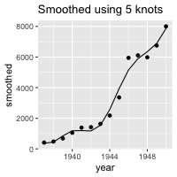

```{r, include = FALSE}
library(fs)
path_airmiles <- path_package(package = "command",
                              "extdata/airmiles")
dir_copy(path = path_airmiles,
         new_path = getwd(),
         overwrite = TRUE)
```

```{r, include = FALSE}
knitr::opts_chunk$set(
  collapse = TRUE,
  comment = ""
)
```

# Introduction


- increasing modularity - make a file behave like a function


```{r setup}
library(command)
library(fs)
```

# Using interactively

- Like 'assign', but a list (show example with list())

- Allowable elements:
    - character string, eg `"Hello world"`
    - integer scalar, eg `3L`
    - numeric scalar, eg `3.141593`
    - date eg `as.Date("2015-11-03")`
    - date-time using `POSIXct, e.g `as.POSIXct("2015-11-03 14:23:03")`
    - date-time using `POSIXlt`, e.g. `as.POSIXlt("2015-11-03 14:23:03")`
    - `NULL`


# Using from the command line

- Run script as normal

```{r}
dir_tree()
```

```{r, comment = "", echo = FALSE}
cat(readLines("data/airmiles.csv"), sep = "\n")
```
```{r, comment = "", echo = FALSE}
cat(readLines("src/fig_smoothed.R"), sep = "\n")
```


```{r}
dir_tree(regexp = "quickstart|workflow|html", invert = TRUE)
```

```{r}

```


```{r}
system2("Rscript src/fig_smoothed.R data/airmiles.csv 5 out/fig_smoothed_5.png")
```

```{r}
dir_tree()
```


```{r, echo = FALSE}

```

```{r}
#system2("Rscript src/fig_smoothed.R data/airmiles.csv out/fig_smoothed_7.png --n=7")
```

```{r, echo = FALSE}
#knitr::include_graphics("out/fig_smoothed_7.png")
```

```{r, comment = "", echo = FALSE}
cat(readLines("report_smooth.Rmd"), sep = "\n")
```

```{r, comment = "", echo = FALSE}
cat(readLines("run_all.sh"), sep = "\n")
```


```{r}
# system2("sh run_all.sh")
```


```{r, include = FALSE, results = "asis"}
#library(magick)
#image <- image_read_pdf("report_smooth.pdf", density = 150)
#image_write(image, path = "report_smooth.png", format = "png")
```


```{r, echo=FALSE}
#knitr::include_graphics("report_smooth.png")
```


# Using from a makefile


```{r, comment = "", echo = FALSE}
cat(readLines("Makefile"), sep = "\n")
```


```{r}
system2("make")
```

```{r}
#system2("touch data/airmiles.csv")
```

```{r}
system2("make")
```